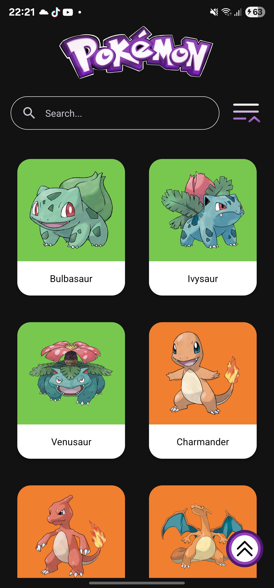
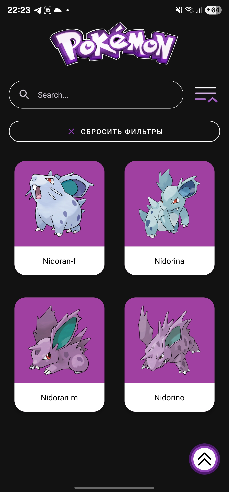
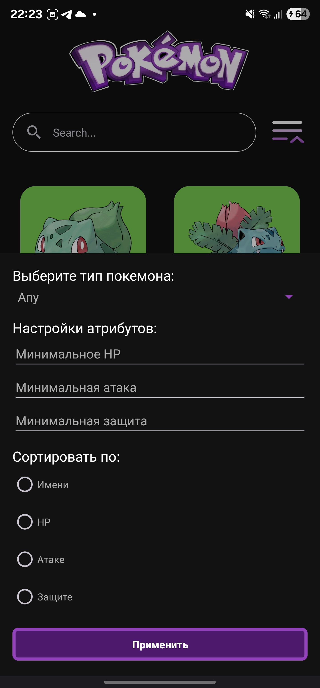
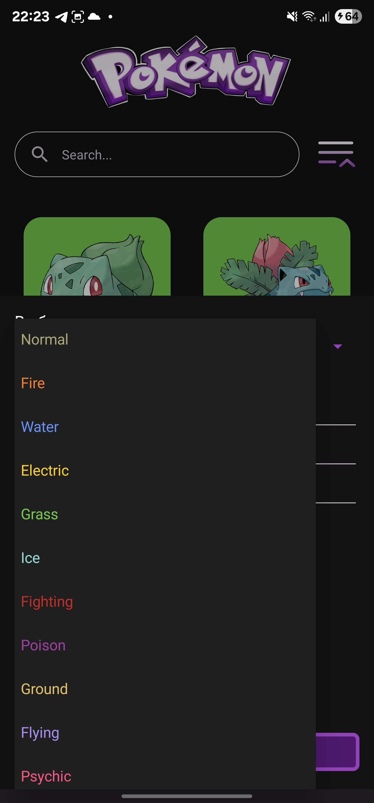

# Pokemon_App

Мобильное приложение **Pokemon_App** — приложение, которое предоставляет информацию о всех покемонах, их характеристиках, типах и способностях. С помощью Pokemon_App вы сможете легко находить, фильтровать и изучать своих любимых покемонов в стильном и удобном интерфейсе.

## Содержание
- [Функциональность](#функциональность)
- [Экраны](#экраны)
- [Особенности дизайна](#особенности-дизайна)
- [Стек технологий](#стек-технологий)

## Функциональность

1. **Просмотр списка покемонов** с пагинацией и бесконечной прокруткой
2. **Поиск покемонов** по имени с мгновенными результатами
3. **Расширенная фильтрация** по типам, характеристикам (HP, атака, защита)
4. **Сортировка** по имени, HP, атаке или защите
5. **Изображения покемонов в высоком качестве**
6. **Оффлайн-режим** с кэшированием данных

## Экраны

### Главный экран с списком покемонов

### Поиск покемонов

### Фильтрация и сортировка

## Особенности дизайна

1. **Фирменный фиолетовый** - основной акцентный цвет приложения
2. **Кастомизированная** Floating Action Button (Плавающая кнопка действия).
2. **Кастомная цветовая система** для типов покемонов
3. **Кастомизированные элементы UI**:
    - **FAB (Floating Action Button)** - уникальный дизайн с плавными анимациями
    - **Кнопки фильтрации и сортировки** - стилизованные под тематику покемонов
    - **Карточки покемонов** - динамическое изменение цвета в зависимости от типа
4. **Переработанный логотип Pokemon** - фиолетовая цветовая схема вместо классической желтой

## Стек технологий

### Frontend
- **Kotlin** `2.0.21`
- **Android SDK** `API 34`
- **Material Design** `1.12.0`

### Архитектура
- **Clean Architecture**
- **MVVM**
- **Repository Pattern**

### Android Jetpack
- **ViewModel** `2.9.2`
- **LiveData** `2.9.2`
- **Room** `2.7.2`
- **Navigation** `2.7.7`
- **Lifecycle** `2.9.2`

### Сетевые запросы
- **Retrofit 2** `2.9.0`
- **OkHttp 3** `4.11.0`
- **Kotlin Serialization** `1.6.0`
- **Retrofit Kotlin Serialization Converter** `1.0.0`

### DI (Dependency Injection)
- **Dagger Hilt** `2.56.1`

### База данных
- **Room** `2.7.2`
- **SQLite**

### Изображения
- **Glide** `4.15.1`

### Асинхронность
- **Kotlin Coroutines** `1.8.0`
- **Flow** `1.8.0`